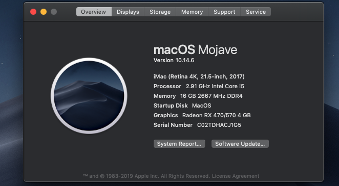

# Hackintosh

Ok with Mojave.

Create boot using UniBeast.

Boot with USB 2.0 port, usb 3.0 ports not working.

All things work well.

## Hardware

    CPU: Intel i5 9400
    GPU: AMD RX470 4GB·
    Main: Gigabyte B360M Pro 4·
    Ram: Kingston 8gb bus 2666 x 2 slots

## BIOS settings

    OC Tweaker \ DRAM Configuration → Load XMP Setting : XMP 2.0 Profile 1
    Advanced \ CPU Configuration → Intel Virtualization Technology : Enabled
    Advanced \ Chipset Configuration → Vt-d : Disabled
    Advanced \ Storage Configuration → Sata Mode Selection: AHCI
    Advanced \ Super IO Configuration → Serial Port: Disabled
    Advanced \ USB Configuration → Legacy USB Support : Enabled
    Advanced \ USB Configuration → PS/2 Simulator : Disabled
    Advanced \ USB Configuration → XHCI Hand-off : Enabled
    Security \ Secure Boot → Secure Boot: Disabled
    Boot → Fast Boot: Disabled
    Boot → Boot From Onboard LAN: Disabled

    - Dedicated graphics
    Advanced \ Chipset Configuration → Primary Graphics Adapter : PCI Express
    Advanced \ Chipset Configuration → IGPU Multi-Monitor : Disabled

    - Integrated graphics
    Advanced \ Chipset Configuration → Primary Graphics Adapter : Onboard
    Advanced \ Chipset Configuration → Share Memory : 128MB
    Advanced \ Chipset Configuration → IGPU Multi-Monitor : Enabled

